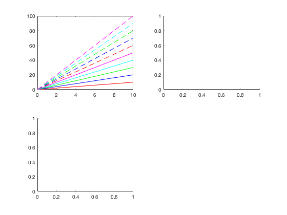
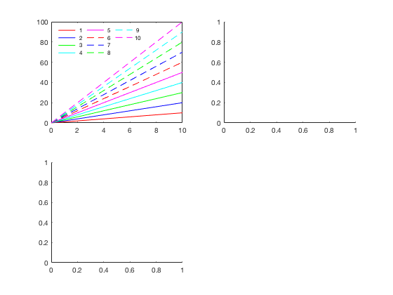
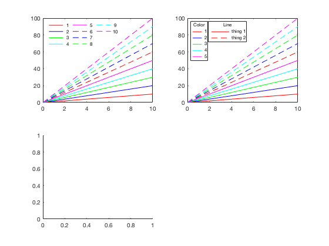
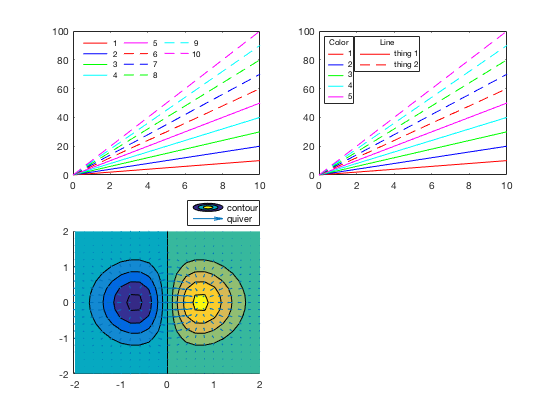

# legendflex.m: a more flexible, customizable legend


Author: Kelly Kearney


This repository includes the code for the `legendflex.m` Matlab function, along with all dependent functions required to run it.


This function offers a more flexible version of the legend command.  It offers a different method of positioning the legend, as well as options to:


- organize legend text and symbols in a grid with a specified number of   rows and/or columns
- rescale the horizontal space used by each legend symbol
- create multiple legends for the same axis
- add a title to the legend within the legend box

This function should support all types of plot objects.


**Legend positioning**


Unlike in the default legend command, where the legend is positioned relative to the labeled objects' parent axis according to one of 16 location strings, this function positions the legend based on two anchor points (one on either the figure or a child object of a figure, and one on the legend itself) and a buffer (or offset) between these two anchor points. The anchor points refer to the corners and centers of each side of the box surrounding the reference object and the legend itself; they can be refered to either as numbers (1-8, clockwise from northwest corner) or strings ('nw', 'n', 'ne', 'e', 'se', 's', 'sw', 'w').  The position of the legend is determined by these two points and the distance between them, defined in the 'buffer' variable, which by default is measured in pixels.  So the combination of


```matlab
(..., 'ref', gca, 'anchor', [3 3], 'buffer', [-10 -10])
```


means that you want the northeast corner of the current axis to be aligned with the northeast corner of the legend, but with the legend shifted 10 pixels to the left and down.


This method of positioning can be particularly useful when labeling a figure that includes many subplots that share a common color scheme, where the "best" location for a legend is not necessarily within the bounds of an axis.  Unlike the legend command, the axes in the figure are never resized (and it is up to the user to check that the legend fits on the figure in the specified location).  In addition to being easier than manually positioning a legend, this function updates the legend location when the figure is resized, preserving the desired alignment.  The following anchor/buffer combinations, when used with the default reference and a buffer unit of pixels, approximately replicate the typical legend locations:


```
Specifier              Anchor    Buffer
```


```
north                  [2 2]     [  0 -10]
south                  [6 6]     [  0  10]
east                   [4 4]     [-10   0]
west                   [8 8]     [ 10   0]
northeast              [3 3]     [-10 -10]
northwest              [1 1]     [ 10 -10]
southeast              [5 5]     [-10  10]
southwest              [7 7]     [ 10  10]
northoutside*          [2 6]     [  0  10]
southoutside*          [6 2]     [  0 -10]
eastoutside*           [3 8]     [ 10   0]
westoutside*           [8 3]     [-10   0]
northeastoutside*      [3 1]     [ 10   0]
northwestoutside*      [1 3]     [-10   0]
southeastoutside*      [5 7]     [ 10   0]
southwestoutside*      [7 5]     [-10   0]
```


```
*placed outside axis rather than resizing plot box
```


## Contents


- Getting started        
- Syntax        
- Examples        
- Contributions

## Getting started


**Prerequisites**


This function requires Matlab R14 or later.


**Downloading and installation**


This code can be downloaded from [Github](https://github.com/kakearney/legendflex-pkg/) or the [MatlabCentral File Exchange](http://www.mathworks.com/matlabcentral/fileexchange/31092).  The File Exchange entry is updated daily from the GitHub repository.


**Matlab Search Path**


The following folders need to be added to your Matlab Search path (via `addpath`, `pathtool`, etc.):


```matlab
legendflex-pkg/legendflex
legendflex-pkg/setgetpos_V1.2
```


## Syntax


```
legendflex(M, param1, val1, ...)
legendflex(h, M, param1, val1, ...)
[legend_h,object_h,plot_h,text_str] = legendflex(...)
```


Input variables:


- `M`:          cell array of strings, labels for legend
- `h`:          handle of axis or handle(s) of object(s) to be labeled.  If                 this is an axis handle, all children of the axis will be                 included in the legend.  If not included, current axis is                 used.

Optional input variables (passed as parameter/value pairs): [default]


- `ncol`:       number of columns, or 0 to indicate as many as necessary                 given the # of labeled objects [1 if nrow is 0, 0                 otherwise]
- `nrow`:       number of rows, or 0 to indicate as many as necessary                 given the # of labeled objects [0]
- `ref`:        handle of object used to position the legend. This can be                 either a figure or a child object of a figure (and does not                 need to relate in any way to the objects being labeled).                 If not included, the reference will be to the axis that a                 normal legend would be associated with (usually the parent                 axis of the labeled objects, unless objects from multiple                 axes are passed, in which case it's the parent object of                 the first labeled object).
- `anchor`:     1 x 2 array specifying which points of the reference object                 and new legend, respectively, to anchor to each other.                 Anchor points can be described using either numbers (in a 1                 x 2 double array) or directional strings (in a 1 x 2 cell                 array) as follows:                 1 = 'nw' = upper left corner,                 2 = 'n' = center of top edge,                 3 = 'ne' = upper right corner,                 4 = 'e' = center of right edge,                 5 = 'se' = bottom right corner,                 6 = 's' = center of bottom edge,                 7 = 'sw' = bottom left corner,                 8 = 'w' = center of left edge,                 [[3 3], i.e. {'ne' 'ne'}]
- `buffer`:     1 x 2 array of horizontal and vertical distance,                 respectively, from the reference anchor point to the legend                 anchor point. Distance is measured in units specified by                 bufferunit. [[-10 -10]]
- `bufferunit`: unit for buffer distance.  Note that this property only                 affects the units used to position the legend, not the                 units for the legend itself (which is always a fixed size,                 based on the space needed to encapsulate the specified                 symbols and text).  The 'normalized' units are normalized                 to size of the figure. ['pixels']
- `box`:        'on' or 'off', specifies whether to enclose legend objects                 in a box ['on']
- `xscale`:     scalar value indicating scale factor to apply to the width                 required by each symbol, relative to the size used by                 legend. For example, 0.5 will shorten the lines/patches by                 half. [1]
- `title`:      A title string to be added inside the legend box, centered,                 above all legend entries.  This can be either a string or a                 cell array of strings; the latter will produce a multi-line                 title. If empty, no title is added.  ['']
- `padding`:    1 x 3 array, pixel spacing added to beginning of each                 column (before symbol), between symbol and text, and after                 text, respectively.  Usually, the default provides the                 spacing typical of a regular legend, but occassionally the                 extent properties wrap a little too close to text, making                 things look crowded; in these cases you can try unsquishing                 (or squishing, via use of negative values) things via this                 parameter. [2 1 1]
- `nolisten`:   logical scalar.  If true, don't add the event listeners.                 The event listeners update the legend objects when you                 change a property of the labeled objects (such as line                 style, color, etc.).  However, the updating requires the                 legend to be redrawn, which can really slow things down,                 especially if you're labelling lots of objects that get                 changed together (if you change the line width of 100                 labeled lines, the legend gets redrawn 100 times).  In more                 recent releases, this also occurs when printing to file, so                 I recommend setting this to true if you plan to print a                 legend with a large number of labeled objects.  The legend                 will still be redrawn on figure resize regardless of the                 value of this parameter. [false]

In addition to these legendflex-specific parameters, this function will accept any parameter accepted by the original legend function (e.g. font properties) except 'location', 'boxon', 'boxoff', or 'hide'.


Output variables:


- `legend_h`:   handle of the legend axis.  It is not linked to an axis or                 graphics objects in the same way as a Matlab legend.                 However, on figure resize, all properties of the legend                 objects are checked for changes, so adjusting the figure                 size can re-link the legend to the labeled objects after                 you have made changes to those objects.
- `object_h`:   handles of the line, patch, and text graphics objects                 created in the legend
- `plot_h`:     handles of the lines and other objects labeled in this                 legend
- `text_str`:   cell array of the text strings used in the legend


## Examples


First, let's create a subplot with 10 lines, 5 solid and 5 dashed, which cycle through 5 colors:


```matlab
figure('color','w');
for iax = 1:3
ax(iax) = subplot(2,2,iax);
end

linespec = [repmat({'r';'b';'g';'c';'m'},2,1), ...
[repmat({'-'}, 5, 1); repmat({'--'}, 5, 1)]];


x = [0 10];
y = (1:10)'*x;
lbl = cellstr(num2str((1:10)'));

hln(:,1) = plot(ax(1), x, y);
set(hln(:,1), {'color','linestyle'}, linespec);
```




Now add a legend in the upper left corner, with the entries arranged in a 4 x 3 grid so it doesn't interfere with the data.  We've also decreased the horizontal space used by each legend line:


```matlab
[hl(1).leg, hl(1).obj, hl(1).hout, hl(1).mout] = ...
legendflex(hln(:,1), lbl, 'anchor', {'nw','nw'}, ...
'buffer', [5 -5], ...
'ncol', 3, ...
'fontsize', 8, ...
'xscale', 0.8, ...
'box', 'off');
```




Plot the same lines in the second subplot.  But this time, let's add two legends: one for color, and one for line style.  Note that in this case, the second legend is positioned relative to the first, rather than relative to the axis itself:


```matlab
hln(:,2) = plot(ax(2), x, y);
set(hln(:,2), {'color','linestyle'}, linespec);

[hl(2).leg, hl(2).obj, hl(2).hout, hl(2).mout] = ...
legendflex(hln(1:5,2), lbl(1:5), ...
'anchor', {'nw','nw'}, ...
'buffer', [5 -5], ...
'fontsize',8, ...
'xscale',0.5, ...
'title', 'Color');
[hl(3).leg, hl(3).obj, hl(3).hout, hl(3).mout] = ...
legendflex(hln([1 6],2), {'thing 1', 'thing 2'}, ...
'ref', hl(2).leg, ...
'anchor', {'ne','nw'}, ...
'buffer', [0 0], ...
'fontsize', 8', ...
'title', 'Line');
```




Our final subplot simply shows that this function will handle all object types.  We plot a `contourf` plot overlaid with a `quiver` plot, and label both above the subplot axis.


*Well, almost any graphics object. In 2014b, there are some rendering bugs when legend is called with multiple outputs that can cause weird stuff to happen when labeling contour objects; these sorts of issues may continue as the Mathworks updates their graphics further.*


```matlab
[X,Y] = meshgrid(-2:.2:2);
Z = X.*exp(-X.^2 - Y.^2);
[DX,DY] = gradient(Z,.2,.2);
axes(ax(3));
hold on;
[c,hcont] = contourf(X,Y,Z);
hquiv = quiver(X,Y,DX,DY);

[hl(4).leg, hl(4).obj, hl(4).hout, hl(4).mout] = ...
legendflex([hcont hquiv], {'contour', 'quiver'}, ...
'anchor',{'ne','se'}, ...
'buffer',[0, 0.01], ...
'bufferunit', 'normalized');
```





## Contributions


Community contributions to this package are welcome!


To report bugs, please submit [an issue](https://github.com/kakearney/legendflex-pkg/issues) on GitHub and include:


- your operating system
- your version of Matlab and all relevant toolboxes (type `ver` at the Matlab command line to get this info)
- code/data to reproduce the error or buggy behavior, and the full text of any error messages received

Please also feel free to submit enhancement requests, or to send pull requests (via GitHub) for bug fixes or new features.


I do monitor the MatlabCentral FileExchange entry for any issues raised in the comments, but would prefer to track issues on GitHub.


<sub>[Published with MATLAB R2016a]("http://www.mathworks.com/products/matlab/")</sub>
